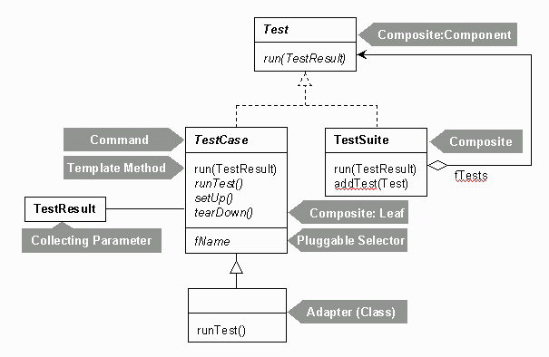
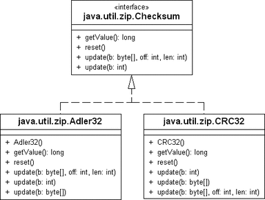

JPatterns: Annotations for clearly specifying Design Patterns in Java
=====================================================================

JPatterns is a collection of annotations that should make it easier to communicate
the use of [Design Patterns](https://en.wikipedia.org/wiki/Software_design_pattern) within your code to your fellow developers and
your future self.

Design Patterns are typically encoded into Java code in an ad-hoc fashion.
They are either embedded into the names of the classes or written into the Javadocs.
Unfortunately it is impossible to accurately determine a pattern based solely on the class structure without knowing the intent of the code author.

We follow the [KISS principle](https://en.wikipedia.org/wiki/KISS_principle) by using reasonable defaults for the annotation attributes.
Thus, if you are writing a composite, you can simply specify:

```java
@CompositePattern
public abstract class Contact {
  public abstract void sendMail(String msg);
  public void add(Contact contact) {}
  public void remove(Contact contact) {}
}
```

Or, if you wanted to, you could also be more explicit, for example

```java
@CompositePattern(role = CompositeRole.COMPONENT,
 participants = {DistributionList.class, Person.class})
public abstract class Contact {
  public abstract void sendMail(String msg);
  public void add(Contact contact) {}
  public void remove(Contact contact) {}
}
```

Please see the [JavaDocs](http://www.jpatterns.org/apidocs/index.html) for complete reference of annotations.

## Presentation
This is presentation from [Devoxx in Antwerp, Belgium](http://www.javaspecialists.eu/talks/pdfs/2010%20Devoxx%20in%20Antwerp,%20Belgium%20-%20%22jpatterns.org%22%20by%20Heinz%20Kabutz.pdf).

### What is JPatterns.org?
* Java annotations for describing patterns in code
* Formalises pattern usage
* In future, we might write tools to extract annotations to help describe systems

### What is JPatterns.org not?
* A set of tools for verifying correct implementation of patterns
  - Patterns help us get started, but they are not final solution
  - The structure is the weakest dominator in the pattern
    * More important is intent and name
    * jpatterns annotates your intent
  - How would you verify that a class is a Singleton?

### Example Adapter Without Annotations
```java
public class Rapper {
  public String talk() {
    return "Vulgar lyrics deleted...";
  }
}

public class RapperClassAdapter extends Rapper implements Singer {
  public String sing() {
    return talk();
  }
}
```

### Example Adapter With Basic Annotation
```java
public class Rapper {
  public String talk() {
    return "Vulgar lyrics deleted...";
  }
}

import org.jpatterns.gof.*;
@AdapterPattern
public class RapperClassAdapter extends Rapper implements Singer {
  public String sing() {
    return talk();
  }
}
```


### Example Adapter With Detailed Annotation
```java
@AdapterPattern.Adaptee
public class Rapper {
  public String talk() {
    return "Vulgar lyrics deleted...";
  }
}

@AdapterPattern.Adapter(
  value = AdapterPattern.Variation.CLASS,
  participants = {Rapper.class, Singer.class})
public class RapperClassAdapter extends Rapper implements Singer {
  public String sing() {
    return talk();
  }
}
```

### Why do we need this?
* Programmers design using well established patterns
* The pattern might not be that obvious to others
* e.g. JUnit was developed test-driven, but Gamma and Beck were talking in patterns

### Classic Methodologies
* e.g. Waterfall Model: Analysis, Design, Implementation, Testing
* Suffers from “Analysis Paralysis”
* Bad decision during analysis very expensive
* Model for large teams with greatly varying skill-sets
* Each iteration takes months


### Agile Methodologies
* e.g. eXtreme Programming
* All programming is done in pairs
  - For constant code reviewing, NOT mentoring
* Very short iterations (days or weeks)
* Testing is done several times a day
* Daily automated build and complete test
  - Designing with Patterns
  - Ruthless refactoring

### Which Methodology to Use?
* Waterfall Model
  - One or two excellent analysts
  - Few good designers
  - Lots of average programmers
  - Suffers from “Peter Principle”
* eXtreme Programming
  - Between 6 and 12 above average programmers per team
  - Fosters cooperation, not competition in team
  - Low staff turnover
  - Chaos if not strictly managed!!!

### Typical Day as Programmer
Let's look at Joe's day at work:
- 08:00 Arrive at work
- 08:30 Had first cup of coffee, erased SPAM
- 09:00 Chatted with coworker about soccer
- 10:00 Had project status meeting
- 11:00 Thought about design problems
  * (Whilst playing minesweeper)
- 12:30 Looked at some critical bugs for important customer
- 13:30 Finished playing “Battlefield 1942” with colleagues
- 15:00 Wrote 200 lines of VB code, answered 5 phone calls
- 16:30 Company meeting entitled “Be more productive”
- 17:30 Wrote emails to bosses and colleagues (and friends)
- 23:30 Time to go home - finished writing TCP/IP stack in assembler


### Programming is a Minority Task
* Most of your time is spent in:
  - Meetings
  - Documentation
  - Planning
  - Testing, bug fixing & support
  - Email
* Even brilliant programmers have to communicate!

### Design Language can Help
* Meetings
  - Communicate more effectively about your designs to colleagues
* Documentation
  - Code documentation can refer to Design Pattern
* Planning
  - You can talk in higher-level components
* Testing, bug fixing & support
  - Better designs will reduce bugs and make code easier to change

Organic First Cold Pressed Virgin Olive Oil
* Design Patterns are like good olive oil
  - You cannot appreciate them at first
  - As you study them you learn the difference between supermarket oil and the real stuff from Heinz's farm
  - As you become a connoisseur you experience the various textures you didn’t notice before
* **Warning: Once you are hooked, you will no longer be happy with bottled oil!**

### Design Patterns Origin
*The Timeless Way of Building*.
*Christopher Alexander*

There is a central quality which is the root criterion of life and spirit in a man, a town, a building, or a wilderness.
If you want to make a living flower, you don’t build it physically, with tweezers, cell by cell. You grow it from the seed.


### Why are patterns so important?
* Provide a view into the brains of OO experts
* Help you understand existing designs
* Patterns in Java, Volume 1, Mark Grand writes
  - "What makes a bright, experienced programmer much more productive than a bright, but inexperienced, programmer is experience."

### What’s in a name?
*The Timeless Way of Building*

The search for a name is a fundamental part of the process of inventing or discovering a pattern.
So long as a pattern has a weak name, it means that it is not a clear concept, and you cannot tell me to make “one”.

### Where are patterns usually documented?
* In the class name: TreeVisitor, FilteredOutputStream
  - But often not, e.g. Runtime, Runnable, Checksum
* In UML class diagrams as text notes
  - But seriously, who draws UML diagrams nowadays?
  - There is no proper tooling support
* In the JavaDocs, but inconsistently
* In a separate design document
  - [JUnit A Cook's Tour](http://junit.sourceforge.net/doc/cookstour/cookstour.htm)

### JUnit Patterns Overview
From the JUnit Cook's Tour



### How do the annotations work?



Code with JPatterns.org Annotations

```java
@StrategyPattern.Strategy
public interface Checksum {
  long getValue();
  void reset();
  void update(int b);
}

@StrategyPattern.ConcreteStrategy
public class Adler32 implements Checksum {
  ...
}

@StrategyPattern.Context
public class FlatFileDatabase {
  @StrategyPattern.StrategyField
  private final Checksum checksum;
}
```

## About
jpatterns.org was conceived during one of the [Java Specialists Club](http://www.javaspecialists.eu/) design patterns sessions as a way to clearly label classes as belonging to some pattern structure using Java annotations.
The project is led by Michael Hunger and Heinz Kabutz.
